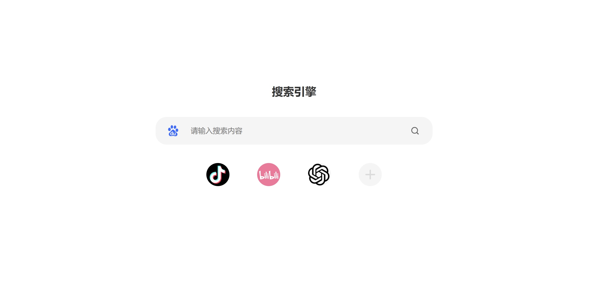

# 🌟 宝宝的标签页

一个简洁动画高级的浏览器扩展插件

 

## 简介
“宝宝的标签页”是一款简洁而高效的浏览器标签页扩展，旨在为用户提供流畅、舒适的体验。插件通过精心设计的动画和界面，创造出轻松的使用环境。功能精简，专注于提升用户的浏览体验。

## 预览网站
https://2012987898.github.io/baobaotab/

可能会有些bug

## 安装方法
1. 打开浏览器并进入扩展管理页面。
2. 启用“开发者模式”。
3. 点击“加载已解压的扩展程序”。
4. 选择解压后的插件文件夹进行加载。

## 联系我们
💬 如需帮助或反馈问题，请联系[我们](#)

- 📢 **Telegram 频道**： [宝宝巴士频道](https://t.me/bbbs999666)
- 💬 **Telegram 聊天室**： [加入聊天](https://t.me/+lRGcqTCkor8zODRl)
